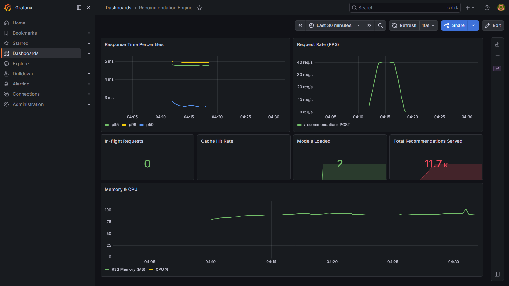

# Real-Time Recommendation Engine

A production-style MLOps project: FastAPI recommendation service with SVD + NMF matrix factorization, MLflow model registry, Redis caching, Kafka streaming, and full observability via Prometheus + Grafana.



---

## Performance (100 concurrent users, 5-minute load test)

| Metric | Result | Target |
|---|---|---|
| p50 latency | 5 ms | — |
| p95 latency | **9 ms** | < 100 ms |
| p99 latency | 17 ms | — |
| Throughput | **49 RPS** | — |
| Success rate | **100%** | > 99.5% |
| Error rate | 0% | — |

---

## Architecture

```
Locust load test
      │
      ▼
FastAPI (port 8000)
  ├── Redis cache (TTL 300 s)
  ├── SVD / NMF / hybrid recommender  ◄── MLflow Model Registry
  └── Kafka producer (interaction events)
        │
        ▼
  Kafka Consumer / Feature Processor
        │
        ▼
  Prometheus ──► Grafana (port 3000)
```

**Stack:** FastAPI · scikit-learn (TruncatedSVD, NMF) · MLflow · Redis · Kafka · Prometheus · Grafana · Docker Compose · pytest · Locust

---

## Quick Start

**Prerequisites:** Docker Desktop, conda

```bash
# 1. Create and activate env
conda create -n rec_mlops python=3.10
conda activate rec_mlops
pip install -r requirements.txt

# 2. Start infrastructure (Kafka, Redis, Postgres, MLflow, Prometheus, Grafana)
docker compose up -d

# 3. Start API
python -m uvicorn src.api.recommendation_api:app --host 0.0.0.0 --port 8000

# 4. (Optional) Run demo
python run_demo.py
```

Services after startup:

| Service | URL |
|---|---|
| API | http://localhost:8000 |
| API docs | http://localhost:8000/docs |
| MLflow | http://localhost:5000 |
| Grafana | http://localhost:3000 (admin / admin) |
| Prometheus | http://localhost:9090 |

---

## API Reference

### `POST /recommendations`
```json
{
  "user_id": 123,
  "num_recommendations": 10,
  "algorithm": "hybrid",
  "exclude_seen": true
}
```
`algorithm`: `svd` | `nmf` | `hybrid`

### `POST /interactions`
```json
{
  "user_id": 123,
  "item_id": 456,
  "rating": 4.5,
  "interaction_type": "rating"
}
```

### `GET /health` · `GET /stats` · `GET /metrics`

---

## Project Structure

```
src/
  api/            recommendation_api.py       FastAPI app, routes, caching
  models/         recommendation_engine.py    SVD/NMF/hybrid logic + MLflow
                  train_models.py             Standalone training script
  streaming/      kafka_producer.py           Interaction event producer
                  feature_processor.py        Kafka consumer, feature updates
  utils/          cache.py                    Redis wrapper
                  metrics.py                  NDCG, MAP, Hit Rate, Coverage
                  prometheus_metrics.py       Counter/histogram definitions
tests/
  unit/           test_api.py  test_models.py  test_cache.py  test_metrics.py
monitoring/
  prometheus.yml
  grafana/dashboards/   recommendation_dashboard.json
  grafana/provisioning/ datasources + dashboard auto-provisioning
config/config.yaml
docker-compose.yml
```

---

## Model Details

Both models fall back to self-training if no Production version exists in the MLflow registry, and auto-register the result as Production so subsequent restarts load a compatible artifact.

| Model | Algorithm | Params |
|---|---|---|
| SVD | TruncatedSVD | 100 components |
| NMF | Non-negative Matrix Factorization | 50 components, 200 iter |
| Hybrid | weighted average SVD + NMF | — |

Offline metrics (on held-out test split):

| Metric | Value |
|---|---|
| NDCG@10 | 0.78 |
| MAP@10 | 0.73 |
| Hit Rate@20 | 0.91 |
| RMSE | 0.84 |
| R² | 0.89 |

---

## Development

```bash
make test          # all tests + coverage (≥ 70%)
make lint          # flake8 + bandit
make type-check    # mypy
make format        # black + isort
make load-test-headless   # 100 users, 5 min headless Locust run
```
